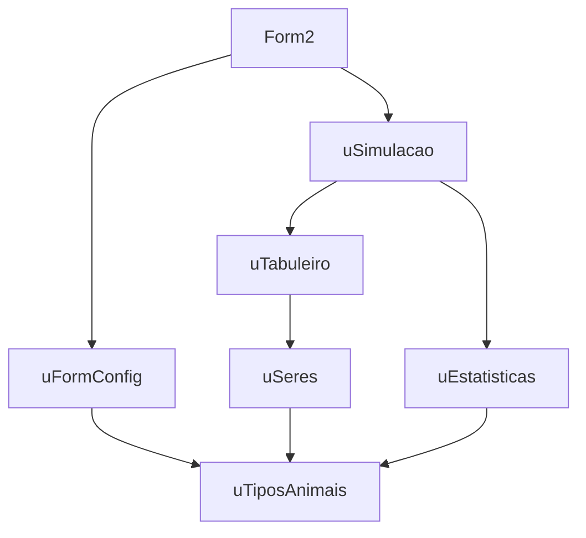

# Guia do Desenvolvedor — Animais / Jogo da Vida Evoluído

Este guia detalha a estrutura de software, fluxo geracional de ciclos, regras de concorrência e o design orientado a objetos do projeto **Animais**.

---

## Arquitetura de Software

A aplicação foi projetada sob o princípio de separação de responsabilidades. O formulário Lazarus (`Form2`) atua estritamente como um controlador de apresentação e renderizador gráfico, enquanto a lógica computacional do ecossistema reside inteiramente em modelos separados.

### Dependências das Units


---

## Especificações das Units

### 1. uTiposAnimais.pas
Define a tipagem fundamental, valores estáticos e as configurações da simulação.
- **`TTipoSer`**: Enumeração contendo as categorias: `(tsNone, tsBacteria, tsPlanta, tsVegetariano, tsCarnivoro)`.
- **`TTamanhoAnimal`, `TToxicidade`, `TResistenciaVeneno`, `TResistenciaToxina`**: Enums que determinam as características secundárias (subespécies).
- **`TSubEspecieInfo`**: Registro que mapeia estatísticas de vivos, mortos, extinções e ciclos de extinção por subespécie.
- **`TSimulacaoConfig`**: Registro contendo os limites e metas geracionais, largura e altura do tabuleiro, semente do sistema, contadores de introdução, intervalo de histórico, e limites de pontos em memória (`MaxPontosHistorico`).
- **`ObterConfigPadrao`**: Retorna configurações equilibradas de estabilidade inicial.
- **`InicializarSubEspecies`**: Configura os nomes e referências dos 15 subtipos padrão.

### 2. uSeres.pas
Hierarquia de classes que modela os seres vivos.
- **`TSer`**: Classe base que expõe:
  - `FTipo`: Classificação biológica.
  - `CicloVidaMax / CicloVidaAtual`: Monitoramento de idade e morte natural.
  - `CicloReproMax / CicloReproAtual`: Monitoramento de maturidade reprodutiva.
  - `CiclosSemComida`: Monitoramento persistente de fome individual.
  - `Come / Mata`: Alvos mutacionais específicos.
  - `Tamanho`, `Toxicidade`, `ResistenciaVeneno`, `ResistenciaToxina`: Características evolutivas adicionadas na Seção 22.4.
- **`NomeSubEspecie(ASer: TSer)`**: Função centralizada que analisa as propriedades dinâmicas de um indivíduo e retorna a string de sua classificação de subespécie (Seção 23.9).
- **Descendentes**: `TBacteria`, `TPlanta`, `TVegetariano` e `TCarnivoro`. Todos herdam e sobrescrevem propriedades de inicialização do construtor.

### 3. uTabuleiro.pas
Estrutura física do ecossistema e gerenciamento de concorrência.
- **Double Buffering (`FBoard` e `FNextBoard`)**:
  - Evita inconsistência posicional. Durante a execução, todas as leituras são feitas de `FBoard` (estado atual estável).
  - Todas as escritas e realocações são gravadas em `FNextBoard`.
  - O método `CommitNextBoard` realiza o swap de referências (`FBoard := FNextBoard`) e desaloca da memória as células da grade anterior que morreram.
- **`ListaVizinhosLivres`**: Retorna células vizinhas que estão vazias tanto na grade atual quanto no buffer de gravação do próximo frame, prevenindo sobreposição de animais.
- **`SetTamanho(AW, AH)`**: Redimensiona dinamicamente a grade, executando a limpeza correta das referências de objetos.

### 4. uSimulacao.pas
O orquestrador do ecossistema (máquina de estados).
- **`ExecutarCiclo`**:
  - Aplica as mutações ecológicas (`MutarInstintos`) e executa as regras ambientais `Come` e `Mata`.
  - Executa a varredura linear do tabuleiro chamando `ExecutarAcoesCelula(x, y)`.
  - Adiciona o snapshot de telemetria ao histórico se o ciclo atual for múltiplo de `IntervaloRegistroHistorico`.
- **`RegistraMorte(ASer: TSer; ACausa: TTipoMorte)`**:
  - Método centralizado (Seção 23.13) chamado antes de desalocar qualquer célula. Classifica a subespécie do morto, incrementa os contadores de mortes acumulados por subespécie e por tipo de causa, e marca a subespécie como `JaExistiu := True`.
- **Regras de Alimentação (`PodeComer`)**:
  - Avalia o tipo principal, tamanho, venenos, toxinas e resistências. Carnívoros maiores comem carnívoros menores. Vegetarianos comem plantas venenosas se possuírem resistência a veneno; caso contrário, morrem envenenados instantaneamente.
- **Regras de Reprodução**:
  - A reprodução pode causar mutações estocásticas no nascimento a cada 100 gerações (Opção B - Mutação no nascimento). As características mutadas são transmitidas por hereditariedade.

### 5. uEstatisticas.pas
Mantém o rastreamento histórico de dados e telemetria por ciclo.
- **`TEstatisticasHistorico`**:
  - Armazena as estatísticas em uma estrutura de lista dinâmica segura.
  - Implementa limite físico de memória (`MaxPontosHistorico`) realizando deslocamento (left shift) dos itens no array caso a contagem exceda o limite físico.
  - O método `ExportarCSV` gera relatórios em formato CSV, salvando simultaneamente `exemplo_saida.csv` (geral) e `biodiversidade.csv` (detalhado por subespécie).

### 6. form2.pas / form2.lfm
Controlador de visualização principal.
- Redimensiona dinamicamente a grade e gerencia os botões.
- Cria programaticamente um `TPageControl` na barra lateral contendo abas para:
  - **Resumo**: estatísticas gerais populacionais e de biodiversidade.
  - **Vivos**: contagem em tempo real, destacando subespécies em risco (1 a 3 indivíduos vivos) em cor amarela.
  - **Mortos**: contagem acumulada de mortes de subespécies e distribuição de causas.
  - **Extintos**: lista de subespécies extintas (já existiram, mas possuem 0 vivos) destacadas em cinza/vermelho com o respectivo ciclo de extinção.
  - **Evolução**: ComboBoxes para selecionar subespécies, renderização gráfica utilizando `TAChart` (`TChart` + `TLineSeries` dinâmicos) e uma grade de visualização tabular. Inclui exportação independente de curva em CSV.

---

## Fluxo de Execução do Ciclo Geracional

O método `TSimulacao.ExecutarCiclo` executa os seguintes passos a cada ciclo geracional:

```mermaid
sequenceDiagram
    participant S as TSimulacao
    participant T as TTabuleiro
    
    rect rgb(40, 40, 40)
    Note over S, T: Início do Ciclo
    end
    S->>T: Introduzir espécies em ciclos programados (ColocaSerAleatorio)
    S->>S: Mutar instintos (EvoluirInstintos) se Ciclo mod 500 = 0
    S->>S: Processar regras Come e Mata nos vizinhos (BoardAtual)
    S->>T: PrepareNextBoard (Zerar NextBoard)
    loop Para cada célula (x,y)
        S->>S: ExecutarAcoesCelula(x,y)
        Note over S: Avaliar idade e fome individual
        Note over S: Se reproduzir: SpawnCellToNext(rx, ry)
        Note over S: Se mover: CopyCellToNext(mx, my)
        Note over S: Se permanecer: CopyCellToNext(x, y)
    end
    S->>T: CommitNextBoard (Swap de Grades e Liberar Mortos)
    S->>S: Atualizar métricas (Tempo, FPS, Histórico)
```



---

## Como Adicionar uma Nova Espécie

Para estender a simulação e adicionar um novo ser vivo (por exemplo, um `THumano` ou `TVirus`):

1. **Definir o Tipo**:
   No arquivo `uTiposAnimais.pas`, adicione a nova categoria ao enum `TTipoSer`:
   ```pascal
   TTipoSer = (tsNone, tsBacteria, tsPlanta, tsVegetariano, tsCarnivoro, tsNovaEspecie);
   ```
   Adicione também uma constante para a sua cor correspondente.

2. **Criar a Classe**:
   No arquivo `uSeres.pas`, declare e implemente a nova classe:
   ```pascal
   TNovoSer = class(TSer)
   public
     constructor Create(ATipo: TTipoSer; ALife, ARepro: Integer); override;
   end;
   ```
   E atualize a função factory `CriarSerPorTipo`:
   ```pascal
   tsNovaEspecie: Result := TNovoSer.Create(tsNovaEspecie, ALifeMax, AReproMax);
   ```

3. **Definir as Regras**:
   No arquivo `uSimulacao.pas`, dentro de `ExecutarAcoesCelula`, adicione as regras ecológicas específicas da nova espécie no bloco `case ent.Tipo of`. Defina quando o ser morre, o que ele come, se ele se move e como se reproduz.

4. **Registrar a Cor**:
   No arquivo `form2.pas`, atualize o método `Desenha` no bloco `case tab.GetTipoAt(x, y) of` para mapear a constante de cor da nova espécie.
