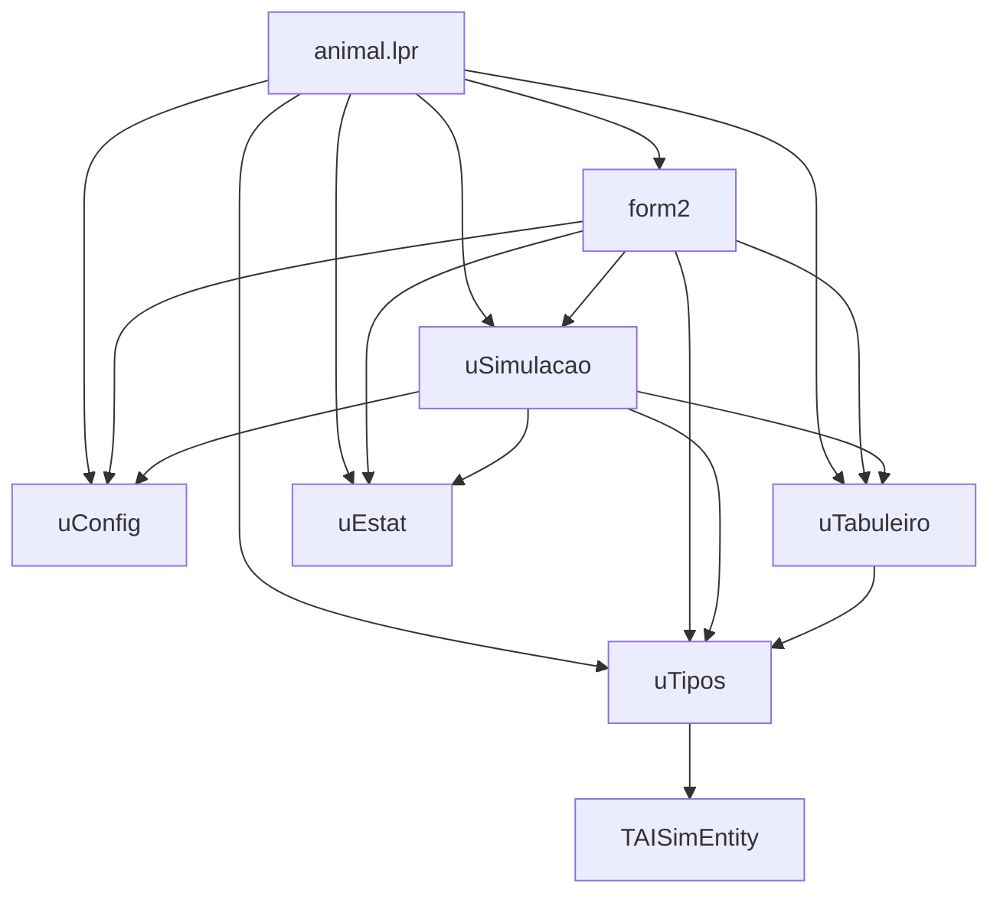

# Guia do Desenvolvedor — Animais

Este documento descreve a arquitetura real da versão atual do projeto **Animais**.

O projeto é uma aplicação Lazarus / Free Pascal que simula um pequeno ecossistema em grade 2D. A versão atual é simplificada e usa as units:

- `uConfig.pas`;
- `uTipos.pas`;
- `uTabuleiro.pas`;
- `uSimulacao.pas`;
- `uEstat.pas`;
- `form2.pas` / `form2.lfm`.

O projeto também declara dependência do pacote `openai_simulation` e usa `TAISimEntity` como ancestral da classe `TSer`.

---

## Dependências das units



---

## 1. `animal.lpr`

Arquivo principal do programa Lazarus.

Responsabilidades:

- inicializar a aplicação;
- carregar `TForm2`;
- declarar as units usadas pelo projeto.

Units carregadas atualmente:

```pascal
Forms, form2, uConfig, uTipos, uTabuleiro, uSimulacao, uEstat;
```

---

## 2. `animal.lpi`

Arquivo de projeto do Lazarus.

Pontos importantes:

- declara dependência do pacote `openai_simulation`;
- declara dependência de `LCL`;
- inclui as units principais do projeto;
- possui caminho local para a biblioteca `CHATGPT`, que pode precisar ser ajustado em outra máquina.

---

## 3. `uTipos.pas`

Define os tipos básicos da simulação.

### Enum `TTipo`

```pascal
TTipo = (tNada, tBacteria, tPlanta, tHerbivoro, tCarnivoro, tMateria);
```

### Classe `TSer`

A classe `TSer` herda de `TAISimEntity`.

Campos principais:

- `Tipo`: tipo do ser;
- `Idade`: idade atual;
- `VidaMax`: idade máxima;
- `Fome`: contador de fome;
- `FomeMax`: limite de fome;
- `Repro`: contador de reprodução;
- `ReproMax`: ciclo necessário para reproduzir;
- `Morto`: marca se a entidade morreu.

Construtor principal:

```pascal
constructor CreateSer(ATipo: TTipo; AVidaMax, AFomeMax, AReproMax: Integer);
```

---

## 4. `uConfig.pas`

Define o record `TConfig` e a função `ConfigPadrao`.

Parâmetros principais:

- `Largura`;
- `Altura`;
- `Seed`;
- `PctBacteria`;
- `PctPlanta`;
- `PctHerbivoro`;
- `PctCarnivoro`;
- `VidaBacteria`;
- `VidaPlanta`;
- `VidaHerbivoro`;
- `VidaCarnivoro`;
- `FomeHerbivoro`;
- `FomeCarnivoro`;
- `ReproPlanta`;
- `ReproHerbivoro`;
- `ReproCarnivoro`;
- `ReproBacteria`;
- `DegradaMateria`;
- `CicloEntradaCarnivoro`.

Na versão atual, a configuração é estática. Não há tela de edição visual dos parâmetros.

---

## 5. `uTabuleiro.pas`

Implementa a grade da simulação.

Estrutura interna:

```pascal
FBoard: array of array of TSer;
FNextBoard: array of array of TSer;
```

`FBoard` representa o estado atual. `FNextBoard` representa o próximo estado a ser confirmado no fim do ciclo.

Métodos principais:

- `SetTamanho(AW, AH)`: cria/redimensiona a grade;
- `InBounds(X, Y)`: verifica se a coordenada está dentro da grade;
- `GetSer(X, Y)`: retorna o ser no estado atual;
- `GetSerNext(X, Y)`: retorna o ser no próximo estado;
- `CelulaLivreNext(X, Y)`: verifica se a posição está livre no próximo estado;
- `PrepararProximo`: limpa o próximo buffer;
- `Mover(X, Y, NX, NY)`: move um ser do estado atual para o próximo estado;
- `Colocar(ASer, X, Y)`: coloca um ser no próximo estado;
- `ColocarNoBoard(ASer, X, Y)`: coloca diretamente no estado atual, usado na semeadura inicial;
- `MarcarMorto(X, Y)`: marca um ser como morto;
- `Commit`: troca os buffers e libera os seres marcados como mortos.

### Atenção técnica

O método `Mover` deve sempre retornar `False` quando não conseguir mover. Vale revisar o código para garantir que `Result` seja inicializado no início do método.

---

## 6. `uSimulacao.pas`

Implementa o motor ecológico da simulação.

A classe principal é `TSimulacao`.

Campos principais:

- `FTab`: tabuleiro;
- `FCfg`: configuração;
- `FCiclo`: ciclo atual.

Métodos principais:

- `Create(const ACfg: TConfig)`: cria simulação e semeia o mundo inicial;
- `ExecutarCiclo`: executa um ciclo completo;
- `SemearCarnivoros`: introduz carnívoros no ciclo configurado;
- `Contar`: retorna estatísticas básicas;
- `Semear`: cria a população inicial;
- `ProcessarCelula`: aplica regras de idade, fome, alimentação, movimento e reprodução;
- `MorrerVirandoMateria`: transforma plantas, herbívoros e carnívoros mortos em matéria orgânica;
- `ObterVizinhosLivresNext`: busca posição livre para movimento/reprodução;
- `ObterPreyAdjacente`: busca presa adjacente.

### Fluxo real de `ExecutarCiclo`

1. Incrementa `FCiclo`.
2. Se `FCiclo = CicloEntradaCarnivoro`, chama `SemearCarnivoros`.
3. Chama `FTab.PrepararProximo`.
4. Percorre todas as células de `FBoard`.
5. Para cada ser vivo, chama `ProcessarCelula`.
6. Chama `FTab.Commit`.

### Regras atuais

- Bactérias podem comer matéria orgânica.
- Herbívoros podem comer plantas adjacentes.
- Carnívoros podem comer herbívoros adjacentes.
- Herbívoros e carnívoros acumulam fome quando não comem.
- Plantas, herbívoros e carnívoros mortos viram matéria orgânica.
- Matéria orgânica pode degradar e virar bactéria.
- Bactérias, herbívoros e carnívoros podem se mover aleatoriamente.
- Seres podem reproduzir quando atingem `ReproMax`.

---

## 7. `uEstat.pas`

Define o record `TEstat`.

Campos:

- `Ciclo`;
- `Bacterias`;
- `Plantas`;
- `Herbivoros`;
- `Carnivoros`;
- `Materia`;
- `Vazios`.

A versão atual mantém apenas um resumo instantâneo. Ainda não existe histórico completo por ciclo.

---

## 8. `form2.pas` / `form2.lfm`

Interface principal da aplicação.

Responsabilidades:

- criar `TSimulacao`;
- controlar o timer `tmCycle`;
- desenhar o tabuleiro no `TImage`;
- atualizar labels de estatísticas;
- iniciar, pausar, parar e reiniciar a simulação;
- exportar o estado atual para `export_form.csv`;
- mostrar mensagem de configuração/sobre.

### Limitações atuais da interface

- Não há tela real de configuração.
- Não há gráficos.
- Não há abas.
- Não há histórico visual.
- A exportação é apenas do estado atual.
- O desenho usa `Canvas.FillRect` por célula, não renderização otimizada por `ScanLine`.

---

## Relação com `CHATGPT / openai_simulation`

A integração atual é inicial e direta:

- o projeto depende do pacote `openai_simulation`;
- `TSer` herda de `TAISimEntity`;
- a lógica do projeto demonstra um cenário compatível com conceitos de simulação por agentes.

Ainda não há uso completo de componentes como `TAIGridWorld`, `TAIMovementEngine`, `TAIRuleEngine`, `TAISimulationStats` ou `TAIScenarioConfig`.

Esses componentes podem ser incorporados em uma próxima etapa.

---

## Como adicionar um novo tipo de ser

1. Adicione o novo tipo ao enum `TTipo` em `uTipos.pas`.
2. Atualize `ConfigPadrao`, se o novo tipo precisar de parâmetros próprios.
3. Atualize `TSimulacao.ProcessarCelula` com as regras do novo tipo.
4. Atualize `TSimulacao.Contar` para contabilizar o novo tipo.
5. Atualize `TForm2.Desenha` para definir uma cor visual.
6. Atualize a exportação CSV, se necessário.

---

## Próximos passos técnicos

1. Inicializar `Result := False` em `TTabuleiro.Mover`.
2. Criar `OnDestroy` no formulário para liberar `FSimulacao`.
3. Criar tela real de configuração.
4. Criar histórico por ciclo.
5. Melhorar exportação CSV.
6. Criar renderização mais eficiente usando bitmap/scanline.
7. Substituir regras fixas por um motor de regras.
8. Migrar gradualmente para os componentes completos de `openai_simulation`.
