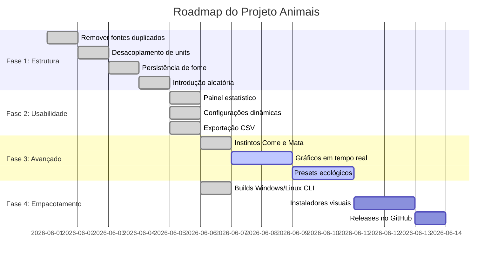

# Roadmap de Desenvolvimento — Animais / Jogo da Vida Evoluído

Este documento detalha o planejamento das fases de melhoria do projeto **Animais**, indicando o status atual de cada funcionalidade.

---

## 🚀 Progresso Geral

---

## 📁 Detalhamento das Fases

### Fase 1 — Correção Estrutural
Focada em estabilizar a base de código do protótipo inicial.
* **[x] Limpeza de redundâncias**: Remoção de arquivos duplicados (`unit1.pas`, `form1.pas`, `main.pas` e seus respectivos `.lfm`) que causavam falhas na IDE.
* **[x] Desacoplamento de código**: Separação completa da lógica de negócio e do tabuleiro em unidades individuais (`uTiposAnimais`, `uSeres`, `uTabuleiro`, `uSimulacao`, `uEstatisticas`, `uFormConfig`).
* **[x] Correção de fome de carnívoros**: Encapsulamento da variável de inanição individualmente dentro do objeto do animal, evitando redefinições ao longo de ciclos.
* **[x] Correção de reprodução excessiva**: Limitação de nascimento para no máximo 1 descendente por ciclo de reprodução por célula.
* **[x] Introdução aleatória**: Posicionamento de novas espécies no tabuleiro em coordenadas livres aleatórias em vez de posições estáticas fixas.

### Fase 2 — Usabilidade
Focada em enriquecer a interação do usuário com a simulação.
* **[x] Painel estatístico**: Sidebar lateral contendo dados em tempo real da população ativa, tempo por ciclo em milissegundos e contadores de frames (FPS).
* **[x] Tela de configurações**: Modal visual permitindo customizar dimensões do tabuleiro (200x200, 500x500, etc.), intervalos de velocidade e limites populacionais.
* **[x] Exportação CSV**: Criação de relatórios exportáveis com o histórico de densidade de cada espécie para análises em softwares de planilhas.
* **[x] Estados dos botões**: Lógica coerente de bloqueio e liberação de botões com base no estado da simulação (Executando, Pausado, Parado).

### Fase 3 — Simulação Avançada
Focada em regras de complexidade ecológica.
* **[x] Propriedades `Come` e `Mata`**: Implementação das regras periódicas de evolução de instintos (a cada 500 ciclos) e aplicação na vizinhança.
* **[ ] Gráficos populacionais**: Inclusão de um componente visual de gráfico na interface para plotagem dinâmica da densidade das populações.
* **[ ] Presets de ecossistema**: Pré-configurações carregáveis (ex: "Deserto", "Floresta Equatorial", "Superpopulação Bacteriana") para facilitar experimentos rápidos.

### Fase 4 — Empacotamento
Focada na distribuição e publicação do projeto.
* **[x] Builds automáticas**: Configuração para compilação multiplataforma Windows e Linux via `lazbuild`.
* **[ ] Versionamento limpo**: Exclusão de arquivos de sessão local da IDE (`.lps`) e arquivos compilados (`.o`, `.ppu`, `.exe`) do rastreamento do repositório através do `.gitignore`.
* **[ ] releases no GitHub**: Automatização e publicação de binários executáveis compilados na aba Releases do GitHub.
